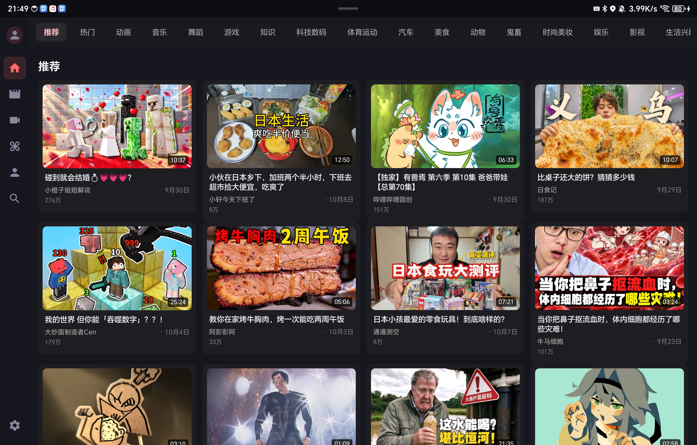
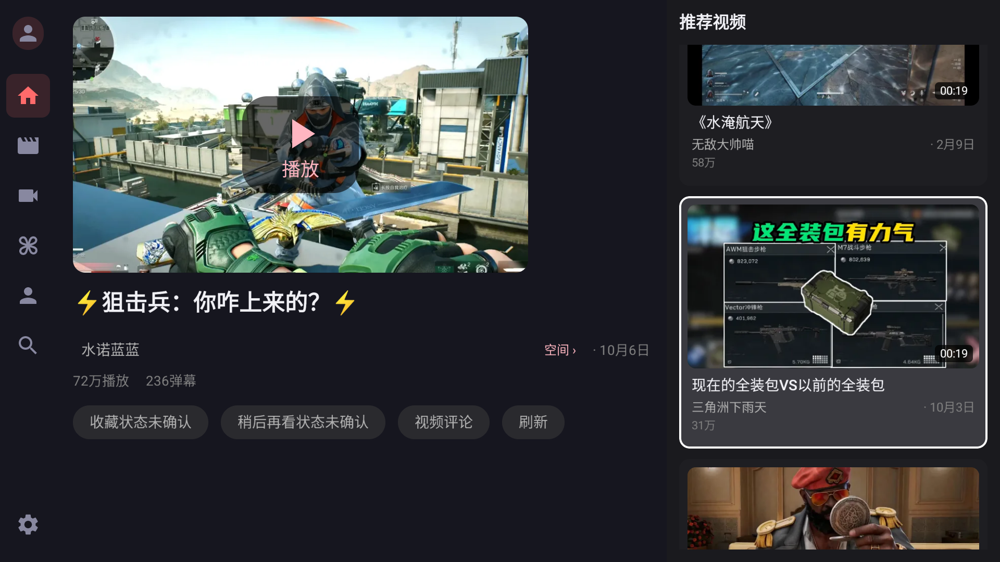
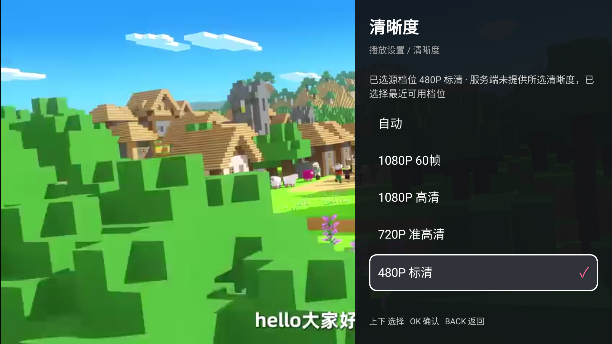
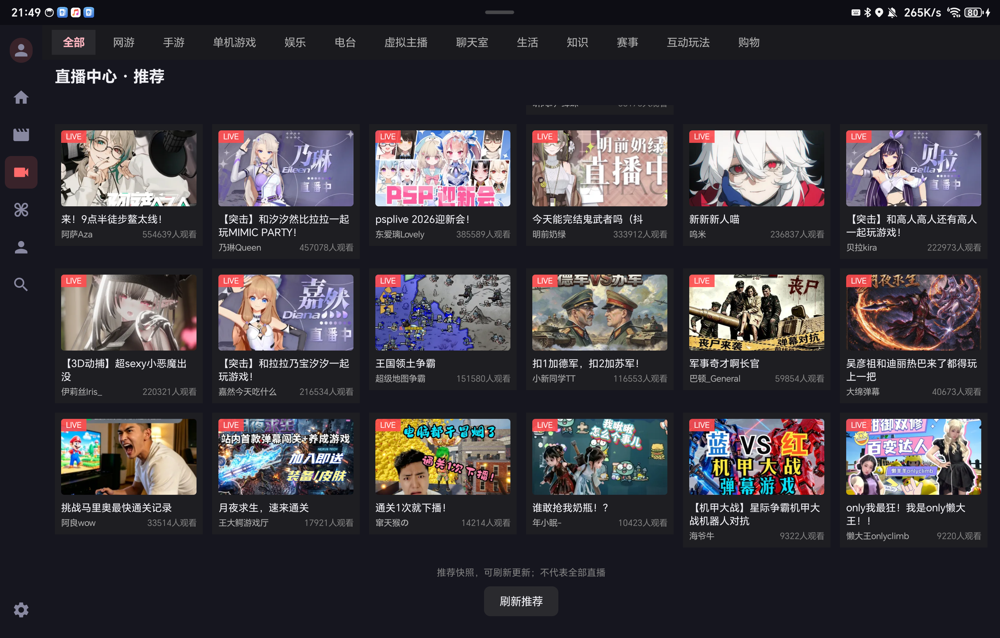
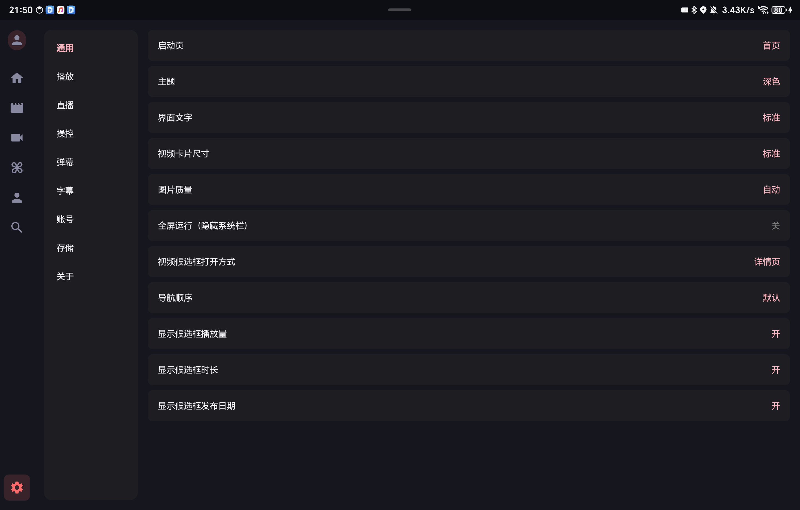
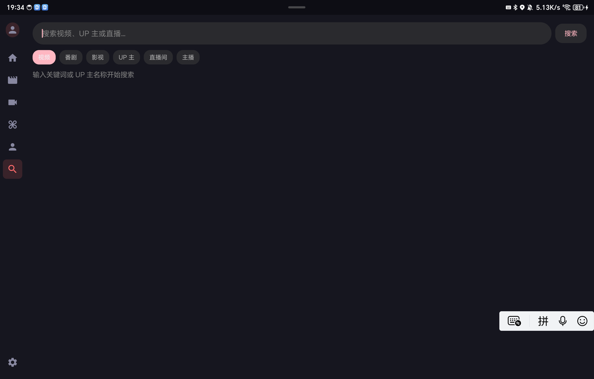

  

# BLBL-ZD

面向 Android 电视、电视盒子的非官方哔哩哔哩客户端项目，支持遥控器操作和触摸操作。主要用于个人学习、Android TV 交互研究与个人设备测试。

**本仓库是安装包发布与问题反馈仓库，仅提供编译后的 APK、版本说明及界面预览，不上传应用源代码，也不作为源码开源仓库。**

[下载安装包](https://github.com/cwe88108/BLBL-ZD/releases) · [查看版本发布](https://github.com/cwe88108/BLBL-ZD/releases/latest) · [反馈问题](https://github.com/cwe88108/BLBL-ZD/issues)

**本项目与哔哩哔哩及其运营主体不存在隶属、合作、代理或官方授权关系。** 项目名称、界面预览及功能描述不表示获得平台或内容权利人的认可。需要稳定服务、完整权益或官方支持时，请使用平台官方产品。

当前说明对应 **1.0.21（versionCode 22）**，更新日期：2026-10-09。

## 界面预览

以下为 1.0.21 开发版本的实机截图，包含电视端和横屏平板界面，不是概念图。正式包与开发包的构建类型不同；截图仅用于说明界面，不表示所有设备、所有内容均已通过验收。推荐、直播、清晰度等内容随服务端、账号状态及设备能力变化。

<table>
  <tr>
    <td width="50%"><strong>首页 · 推荐与分类</strong> </td>
    <td width="50%"><strong>视频详情 · 推荐卡片</strong> </td>
  </tr>
  <tr>
    <td><strong>播放设置 · 清晰度</strong> </td>
    <td><strong>直播 · 分类与房间列表</strong> </td>
  </tr>
  <tr>
    <td><strong>设置 · 通用偏好</strong> </td>
    <td><strong>搜索 · 系统输入法</strong> </td>
  </tr>
</table>

截图中的视频画面、封面、标题、头像及商标等属于相应权利人；展示不构成对这些内容的再利用授权。如权利人认为展示不适当，可通过本仓库 Issue 提出删除或替换请求。

## 功能概览

| 模块 | 当前提供的功能 |
| --- | --- |
| 首页 | 推荐、热门与分区浏览；视频卡片展示作者、发布日期等信息；重复确认当前侧栏栏目可刷新内容 |
| 视频详情 | 视频信息、作者入口、评论入口、右侧推荐卡片；窄屏使用上下布局 |
| 视频播放 | 播放/暂停、进度调整、长按连续快进/快退、分P与播放队列；清晰度、编码、倍速和画面比例等设置 |
| 播放设置 | 适配遥控器的侧边设置面板；区分当前播放设置和设备默认偏好；字幕、音轨等选项取决于内容是否提供 |
| 弹幕 | 多轨滚动、防重叠、透明度/字号/速度、屏蔽规则；顶部1/8、1/4、1/2、3/4或全屏显示区域 |
| 直播 | 分类与二级分类、房间列表和直播播放；服务端可用的画质/线路选择、画面比例和弹幕区域设置 |
| 动态与我的 | 视频动态、观看历史、收藏及稍后再看等入口；账号相关内容需要登录并具有相应权限 |
| 搜索 | 视频、番剧、影视、UP主、直播间及主播等分类搜索；单击输入框或遥控器确认可唤起系统输入法 |
| 账号 | 扫码登录、账号切换和退出登录入口 |
| 全局设置 | 通用、播放、直播、操控、弹幕、字幕、账号、存储和关于；设置备份/恢复及范围恢复默认等入口 |

以上是当前实现范围，不是功能永久可用或与官方客户端完全一致的承诺。平台接口变化、账号状态、地区限制和系统能力均可能影响结果。

### 1.0.21 近期改进

- 搜索框单击或遥控器确认即可显示系统输入法，无需长按。
- 激活侧栏栏目后，焦点保留在原按钮；对应列表从首行展示。
- 直播开场按键提示显示10秒后隐藏，中途缓冲不重新延长倒计时。
- 弹幕增加稳定多行分配、碰撞避让和逐帧滚动，暂停时停止移动；可设置显示区域。

## 系统要求与安装

- **Android 8.0 及以上（API 26+）**。当前正式版不支持 Android 4.4～7.x；旧系统兼容版尚未交付。
- 主要面向横屏电视和电视盒子，也支持横屏平板；建议配合方向键、确认键、返回键使用。
- 需要联网。高分辨率、高帧率、HDR及不同编码的播放效果取决于内容、账号权限、网络和设备解码能力。

发布的安装包请从 **[本仓库 Releases](https://github.com/cwe88108/BLBL-ZD/releases)** 获取，并核对该发布附带的 SHA256 校验值；仓库没有发布对应文件时，不代表其他渠道的同名文件由本项目提供。尚未创建正式发布时，“最新版本”链接可能没有对应页面，请以 Releases 中实际列出的发布为准。

1. 下载与目标设备系统相符的正式 APK，通过设备安装器安装。
2. 如系统提示，按需允许本次安装来源；无需为本项目关闭系统安全保护或授予 Root 权限。
3. 启动后可先浏览公开内容；需要账号功能时，再按界面提示扫码登录。不要向任何人提供账号密码或会话凭据。

同包名、同签名且版本号允许时，可覆盖升级。此前安装的测试包、调试包或其他渠道的同名包可能采用不同签名；签名不一致时不能直接覆盖。卸载会清除本机应用数据，操作前请自行确认需要保留的设置。

## 遥控器操作

| 操作 | 说明 |
| --- | --- |
| 方向键 | 在导航、视频卡片和设置项之间移动焦点 |
| 确认键 / OK | 激活当前按钮或卡片；输入框获得焦点后，确认可唤起系统输入法 |
| 返回键 / BACK | 关闭当前面板、返回上一级；播放页会结合当前控制栏/弹窗状态处理返回 |
| 菜单键 / MENU | 在播放页打开播放设置；没有菜单键时可使用屏幕控制栏的设置入口 |
| 播放页左右键 | 在进度操作状态下快退/快进，长按可连续调整；设置面板内按面板提示操作 |

直播与点播的可用操作不同，直播不提供点播式进度拖动。不同遥控器的按键上报和系统输入法行为可能不同，请以界面提示为准。

## 使用边界与权利说明

### 平台、内容与商业权益

本项目提供客户端界面和交互实现，不运营视频内容平台，不托管或售卖节目内容，也不提供平台会员、账号或播放权益。

- 使用前请阅读并遵守[哔哩哔哩用户使用协议](https://www.bilibili.com/protocal/licence.html)、相关服务规则、适用法律法规及内容版权要求。项目公开不表示已获平台接口使用或第三方商业运营授权。
- 尊重平台、创作者及其他权利人的合法权益。不得利用本项目绕过会员、付费、版权、地域、DRM或其他访问控制；不得将可访问或可播放误认为获得下载、传播、改编或商业使用授权。
- 不得利用本项目进行批量采集、账号滥用、恶意请求、刷量、攻击或其他干扰平台正常运营的行为。功能失败时，不应通过持续高频重试或规避风控方式强行访问。
- 项目面向个人学习与设备测试，不提供商业使用授权。请勿将本项目包装成官方产品，或用于售卖会员/账号、收费代装、商业预装、引流获利等可能侵害第三方权益的活动；不要在平台官方账号评论区刷屏宣传。
- 高画质、音轨、字幕及付费内容的可用性由服务端和合法账号权益决定。本项目不作“免费解锁”“永久可用”“全内容可看”等承诺，不替代官方客户端、会员服务或创作者的商业渠道。

“学习研究”“个人使用”或本说明本身均不构成豁免，也不能消除实际行为产生的法律责任。开发者、分发者及使用者仍应各自履行适用义务；本说明不免除任何依法应承担的责任。

### 账号与隐私

登录和账号操作涉及会话凭据。应用会在设备上保存登录会话、偏好及本地观看记录等数据；访问内容、获取账号资料或执行收藏等操作时，会与相应平台服务通信。

不要在 Issue、截图、日志或公开仓库中提交登录二维码、Cookie、SESSDATA、bili_jct、Token、完整播放地址、账号资料或签名密钥。诊断信息提交前请自行检查并脱敏。公共或转让设备上使用后，应退出登录并清理应用数据；必要时在官方账号安全中心管理会话。

### 权利反馈

如平台、创作者或其他权利人认为安装包、应用功能、描述或截图涉及其合法权益，请通过[本仓库 Issues](https://github.com/cwe88108/BLBL-ZD/issues)说明相关版本/功能、权利依据和具体诉求，避免公开个人证件等敏感材料。维护者可据反馈核查、修改、移除相关内容或暂停分发；请勿将问题提交给被参考项目的维护者。

## 已知限制

- 当前版本仍在持续完善，尚未完成所有设备、实体遥控器和异常恢复场景的验收。
- 接口、登录、推荐、分区和直播结果可能变化或暂时不可用；部分列表可能采用推荐快照，不代表平台全部内容。
- 高画质选项存在不代表服务端已提供对应源；切换结果以实际返回的播放源和界面状态提示为准。
- 字幕和音轨依赖视频本身提供的数据；没有可用数据时，不会因为修改偏好而生成额外字幕或音轨。
- 文件导出、设置备份和诊断报告保存依赖系统文件选择器；部分盒子系统没有该组件。
- 当前未配置应用内自动更新来源，请自行查看[本仓库 Releases](https://github.com/cwe88108/BLBL-ZD/releases)。

## 仓库发布范围

本仓库公开的内容包括：

- Releases 中编译并签名的 APK 及相应校验文件。
- README、版本变更说明、使用说明和界面截图。
- Issues 中经过脱敏的问题反馈。

应用源代码、开发工程、内部测试资料、签名私钥、账号数据及未经脱敏的诊断记录不在本仓库的公开范围内。GitHub 自动生成的 “Source code (zip/tar.gz)” 仅是本发布仓库对应提交的归档，不包含未上传的应用源代码，也不表示应用已开源。

## 反馈问题

通过[本仓库 Issues](https://github.com/cwe88108/BLBL-ZD/issues)提交应用版本、设备型号、Android版本、遥控器类型、复现步骤、预期结果和实际结果；必要时附上已脱敏截图或日志。请勿提交包含账号凭据的原始诊断文件。

与官方账号权益、内容授权或会员购买有关的问题，请通过平台官方渠道处理。本项目不代办相关服务，也不保证第三方接口行为。

## 参考与致谢

本项目的交互研究与文档编写参考了以下项目的公开资料：

- [cat3399/blbl](https://github.com/cat3399/blbl)：Android客户端界面组织、遥控器与触摸操作思路，以及公开项目的使用边界说明。
- [chinasoul/BT](https://github.com/chinasoul/BT) 及其[发布说明](https://github.com/chinasoul/BT/releases)：Android TV使用场景、播放器设置和功能变更说明方式。
- [xiaye13579/BBLL](https://github.com/xiaye13579/BBLL)、[aaa1115910/bv](https://github.com/aaa1115910/bv)：电视客户端交互设计参考。
- Android、Kotlin、Jetpack Compose、Media3、Room、DataStore、OkHttp及其他依赖项目的维护者。

上述链接仅说明参考来源，不表示原作者参与维护、为本项目背书或授予额外权利。第三方代码与资源的使用应分别遵守其许可要求；致谢不能代替许可证、署名或授权义务。

## 软件与第三方权利

本仓库公开安装包，不公开应用源代码，也不以开源许可证授权本应用。能够下载 APK，不等于获得修改、重新打包、再分发或商业使用的授权；需要超出个人设备测试范围使用时，应先核实相应权利与许可。

本说明仅表达本项目的发布范围，不改变任何第三方代码、依赖、素材、内容或商标的原有权利。安装包分发仍应履行所使用第三方组件的许可要求，包括适用的署名、许可文本以及源码提供义务；不能仅以“本项目不开源”排除这些义务。相关权利以各自适用许可为准。
